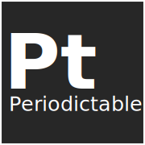
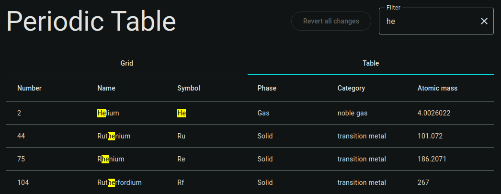
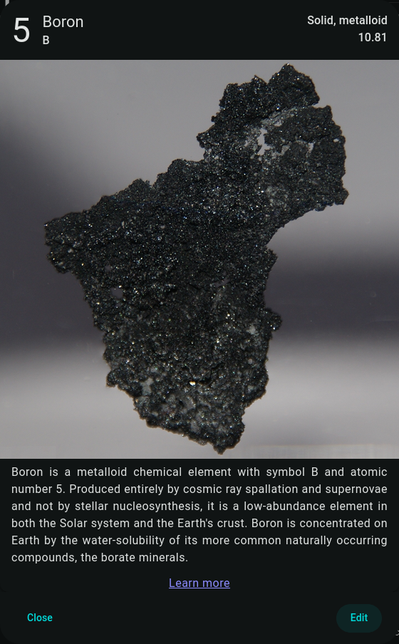
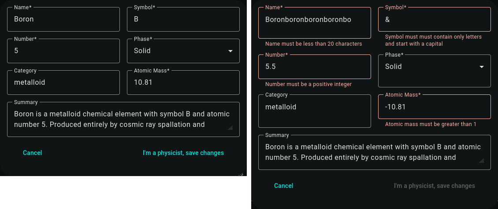
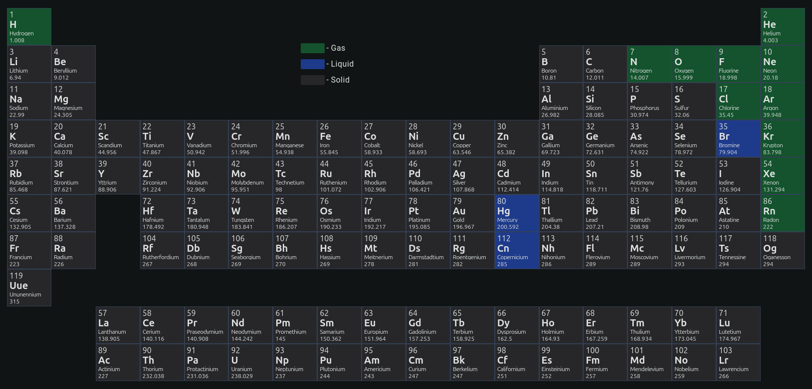
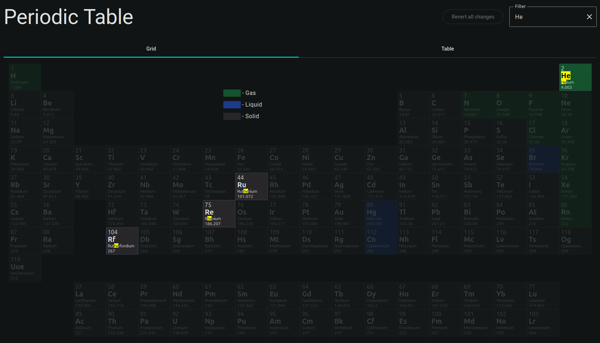

<h1 align="center">
  
  <br>
  Periodic Table
</h1>

This project was developed as a recruitment task for an Angular Developer position. It is a simple periodic table of elements with a search bar and a modal with detailed information about each element.

JSON containing all the elements' data comes from [here](https://github.com/Bowserinator/Periodic-Table-JSON).

Deployed version available at [elements.steciuk.dev](https://elements.steciuk.dev).

## Task description
- Create a view, displaying a table of elements (columns: `Number`, `Name`, `Weight`, `Symbol`).
- Simulate downloading data during the application initialization.
- Add a possibility to edit the fields of the selected element (popup + input fields). After confirming the changes, the table should be updated. Editing should be done without mutating the original data.
- Add an input that allows you to filter elements by all fields. Filtering should happen after 2 seconds of inactivity.
- As the initial data, use:

```ts
const ELEMENT_DATA: PeriodicElement[] = [
{position: 1, name: 'Hydrogen', weight: 1.0079, symbol: 'H'},
{position: 2, name: 'Helium', weight: 4.0026, symbol: 'He'},
{position: 3, name: 'Lithium', weight: 6.941, symbol: 'Li'},
{position: 4, name: 'Beryllium', weight: 9.0122, symbol: 'Be'},
{position: 5, name: 'Boron', weight: 10.811, symbol: 'B'},
{position: 6, name: 'Carbon', weight: 12.0107, symbol: 'C'},
{position: 7, name: 'Nitrogen', weight: 14.0067, symbol: 'N'},
{position: 8, name: 'Oxygen', weight: 15.9994, symbol: 'O'},
{position: 9, name: 'Fluorine', weight: 18.9984, symbol: 'F'},
{position: 10, name: 'Neon', weight: 20.1797, symbol: 'Ne'},
];
```

- As the components library, use [Angular Material](https://material.angular.io/).
- Use Angular 18.2.2.
- Data received from the mock should be stored in the application state.
- Subscription management should be handled by the framework as much as possible. Use `.subscribe()` only when necessary.
- Use [RxAngular](https://www.rx-angular.io/) for handling observables.

## Extra features
In addition to the original requirements, I decided to expand on the task by adding some extra features.

### Data source
Instead of using the provided data, I decided to use [a JSON file containing all the elements](https://github.com/Bowserinator/Periodic-Table-JSON/blob/master/PeriodicTableJSON.json). This enabled me to show more columns in the table, as well as add more details to the [elements' modal](#elements-details).

### Data persistence
All the elements' data is stored in the browser's [IndexedDB](https://developer.mozilla.org/en-US/docs/Web/API/IndexedDB_API). Changes made to the elements can be reverted by clicking the `Revert all changes` button.

### Data filtering
In addition to regular filtering elements by all fields, I added a highlighting of the search query matches in the table and the [grid view](#grid-view).



### Elements' details
After clicking on an element's row in the table or on an element's cell in the grid view, a modal with detailed information about the element is displayed. The modal contains the following information:
- name,
- symbol,
- atomic number,
- atomic mass,
- phase and category,
- an image of the element,
- a summary of the element,
- a link to the element's Wikipedia page.

<p align="center">
  
</p>

Clicking on the `Edit` button opens a [form](#edit-element-form) with the element's data, which can be edited and saved.

### Edit element form
The form for editing an element's data is displayed in a modal after clicking the `Edit` button in the [element's details modal](#elements-details). The form contains the following fields:
- name,
- symbol,
- atomic number,
- phase,
- category,
- atomic mass,
- summary.



### Grid view
In addition to the table view, I added a grid view, which displays all the elements in a traditional periodic table layout. Elements are color-coded based on their phase. Clicking on an element's cell opens the [element's details modal](#elements-details).



Grid view with highlighted search query matches:


